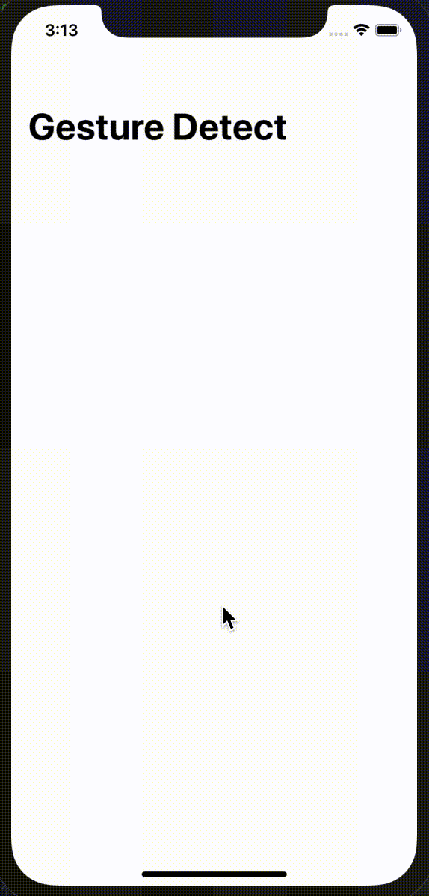

# 100Apps-13GestureDetect

App 13 of my 100 App Challenge - https://github.com/Whoopinstick/100AppsChallenge

13 - Gesture Detect

Written with SwiftUI

This simple app detects swipe (drag), tap, double tap, and long press gestures from the user.    
Touches are shown from the simulator by enabling the command line feature -  
defaults write com.apple.iphonesimulator ShowSingleTouches 1  

